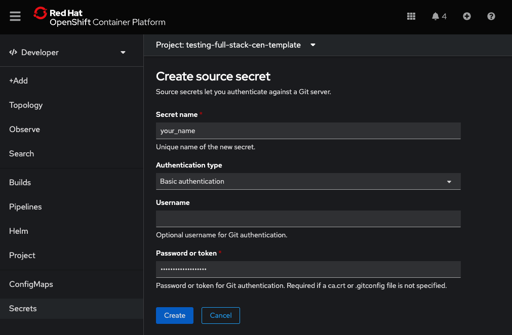
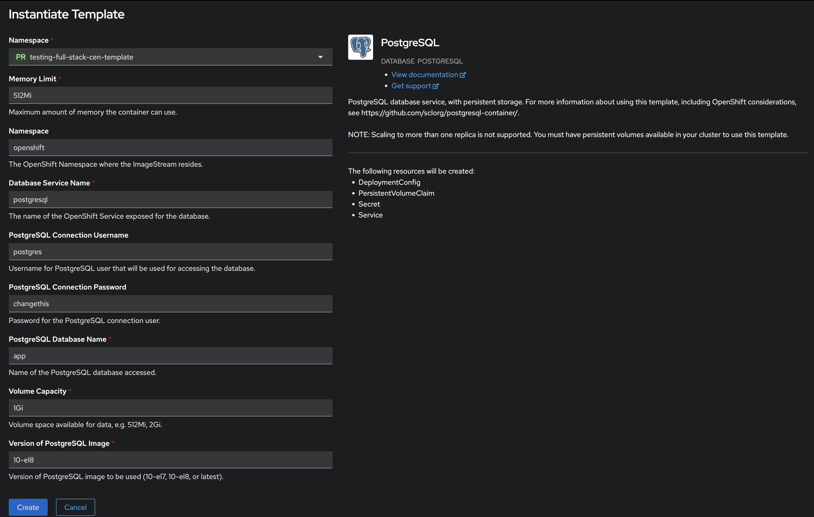
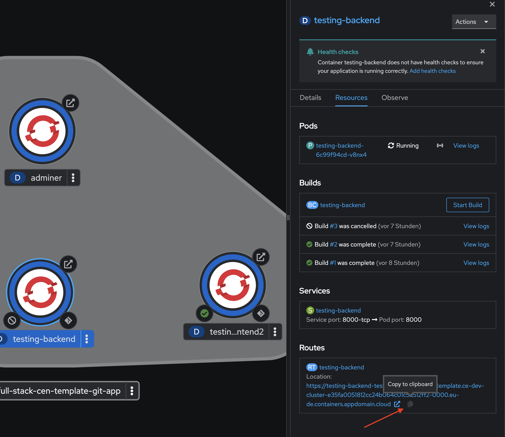
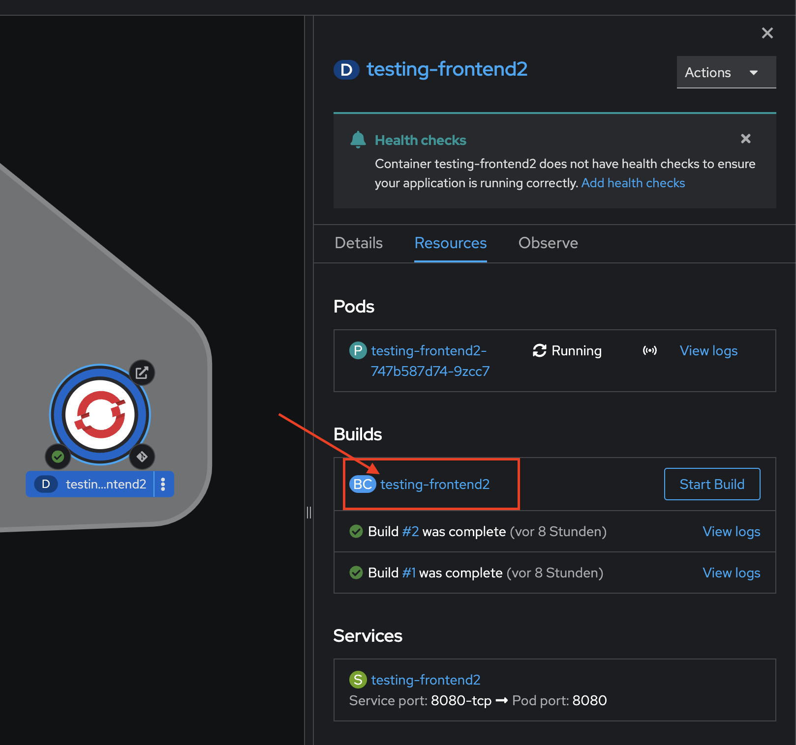
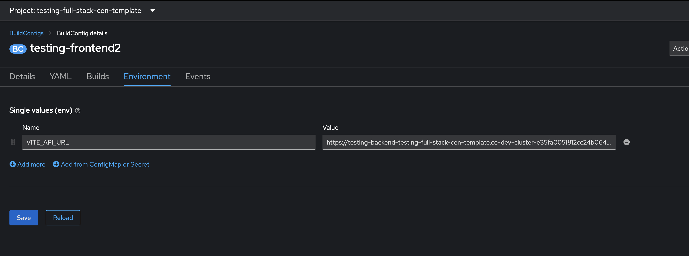
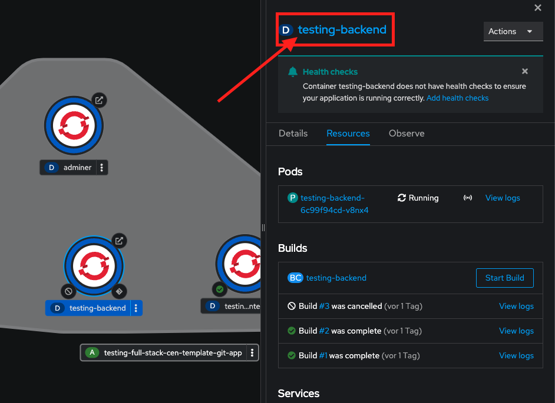
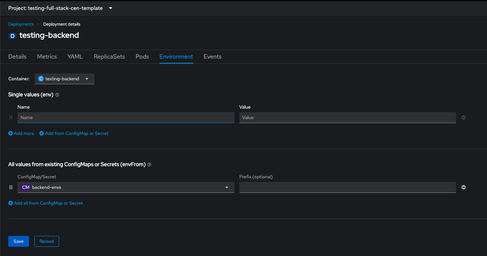
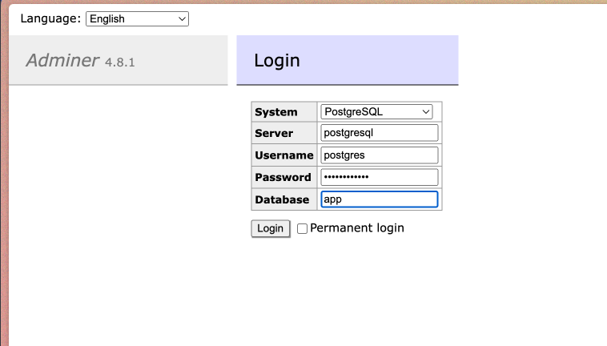

# OpenShift Deployment

In this guide, we will look at two ways to deploy to OpenShift:

---

### 1. Using the OpenShift Deployment Script ([../scripts/oc-deploy.sh](../scripts/oc-deploy.sh))

Prerequisites:

- OpenShift CLI installed (`brew install openshift-cli`)
- Code pushed to a Git repository (GitHub/GitLab)
- Access to an OpenShift instance
- Logged in to OpenShift CLI (`oc login --token=<token> --server=<server-url>`) - _( you can grab the token from the OpenShift UI in the top right corner )_

To use the script:

```bash
./scripts/oc-deploy.sh
```

you might have to change the permissions of the script

```bash
chmod +x scripts/oc-deploy.sh
```

The script will guide you through the deployment process and handle all the necessary steps automatically.

_Note: All the steps in the script can be done manually over the terminal with the OpenShift CLI if you prefer to do so._

---

### 2. Using the OpenShift UI

The steps should be performed in this exact order.

1. [Preparation](#preparation)
2. [Deploying the Database](#database)
3. [Deploying the Backend](#backend) ⚠️ It will run with errors until the [config map](#env-config-map) is finished (which we can only finish in the end).
4. [Deploying the Frontend](#frontend)
5. [Finish up the Env Config Map](#env-config-map)
6. [Setup a deployment hook](#setup-a-deployment-hook)

## Preparation

1. If not already done, have this codebase pushed to your Gitlab/Github repo
2. Create AccessToken (Gitlab) for your project in Gitlab or create and ssh key (Github) (❗️Currently only tested with Gitlab AccessToken❗️)
3. Get OpenShift Instance, Open the Console and access the "Developer View"
4. Create a new project in OpenShift
5. Put the AccessToken in OpenShift as a Secret (Source Secret) (❗️Currently only tested with Gitlab AccessToken❗️)
   - Username is empty
   - Password is the token



## Database

1. In you project click "+Add" → Developer Catalog → Database → PostgreSQL → Instantiate Template
2. Fill out the Template according to the Screeshot, **MAKE SURE TO CHANGE THE PASSWORD** of the PostgreSQL User.
3. Click "Create"
4. If you are not automatically redirected, you can monitor the instanciation progress in "Topology".



❗️Sometimes the database "app" is not created automatically, you can create it manually though.

- In Topology click on your database Deployment and then click the running pod.
- Click the "Terminal" tab.
- type "psql"
- with "\l" you can list all databases
- with "CREATE DATABASE app;" you can create the database

## Backend

1. In you project click "+Add" → import from git
2. Input your repo-url and open "Advanced Git Options"
3. Then enter `/backend` as Context dir
4. Select the Source Secret, that you have set up before in [Preperation](#preperation)

.png>)

5. Select Dockerfile as Import Strategy
6. Define the Name of the Dockerfile to `Dockerfile`
7. Name your Application (Name for everything alltogether) and this particular Service (the backend)
   ❗️ make sure to use `backend` as name for the service, otherwise the frontend will not be able to find it ❗️

.png>)

8. Set the port to `8000`
9. If not already set choose "create route"

.png>)

10. Click "Create" and - again, monitor the deployment progress in "Topology"
11. Move your database container into the application group (with "⇧shift" + drag&drop)

**<mark>Don't worry, deployment will run with errors at this point, since config map is not set yet - we will solve this later</mark>**

## Frontend

We start with the deployment of the frontend. The steps are basically similar to the deployment steps of the backend, but we will go through every step needed, to make sure we got everything right!

1. In you project click "+Add" → import from git
2. Input your repo-url and open "Advanced Git Options"
3. Then enter `/frontend` as Context dir
4. Select the Source Secret, that you have set up before in [Preperation](#preperation)

5. Select Dockerfile as Import Strategy
6. Define the Name of the Dockerfile to `Dockerfile`
7. Use the same Application (Name for everything alltogether) and set a new name for this particular Service (the frontend)

.png>)

8. Set the port to `8080`
9. If not already set choose "create route"

.png>)

10. Click "Create" and - again, monitor the deployment progress in "Topology"

You can either wait for the first successful build, or directly open the BuildConfig of the Frontend Deployment, where we have to tell the frontend under which URL it can find it's backend.

11. To do so, we copy the backend URL to our clipboard. This specific URL can be found trough the Topology view.



12. After we copied the URL we open up the BuildConfig of our frontend.



13. In the top bar of the BuildConfig, we switch the view from Details to Environment.
14. There we provide the BC with a new Name-Value pair. The name has to be set to `VITE_API_URL` and the Value is the copied URL from our backend.



15. We click on "Save" → head back to the Topology view → Click on the frontend-node → under Builds click on "Start Build".
16. After the second build is complete, the frontend knows under which URL the backend can be accessed.

🙌 In the end, the frontend is running without any errors. Now we have to finalize all the environment variables that the backend needs, to be able to fully function.

## Env Config Map

For the backend to fully function it needs these 12 environment variables we have to define within a ConfigMap in OS.

```yaml
POSTGRES_PASSWORD: <ichangedthis>
FIRST_SUPERUSER_PASSWORD: <changethis>
POSTGRES_DB: app
BACKEND_CORS_ORIGINS: "<the frontend URL of the deployment>"
POSTGRES_PORT: "5432"
POSTGRES_SERVER: postgresql
SECRET_KEY: <changethis>
PROJECT_NAME: <your_project_name>
POSTGRES_USER: postgres
ENVIRONMENT: production
FIRST_SUPERUSER: <myexampleadmin@email.com>
```

1. We start with opening the ConfigMaps tab → on the top right corner we click on "Create ConfigMap".
2. We will provide it with an according name, e.g. `backend-envs` and start filling it with the defined 12 env variables.

.png>)

3. Save your config and go back to Topology and click on your backends "Deployment"
4. Go to Environment and link your Env Config Map with "Add all from ConfigMap or Secret"





## Adminer

Deploy the Adminer Service... It's for monitoring and debugging the database.

1. Click "+Add" → "Container Images"

Image name from external registry:

`docker.io/library/adminer`

2. Click "Create"
3. Click the route of your Adminer Deployment
4. Login to Adminer



## Setup a Deployment Hook

How we can setup the Deployment Hook for some kind of "Continuos Delivery" between the main branch of our GitHub/GitLab Project and OS-Deployment.

1. Go to your Backend's build config
2. Copy the **"Generic Webhook"** adress (works for GitLab too)

.png>)

3. Create a new Webhook in Gitlab / Github and paste your Webhook URL

.png>)
